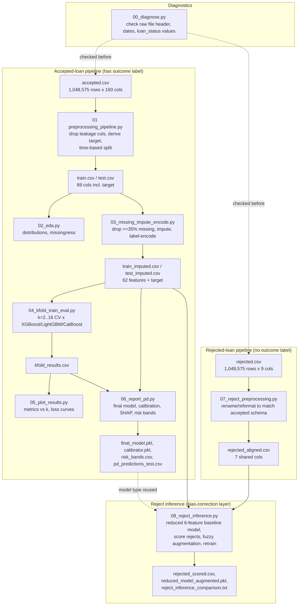
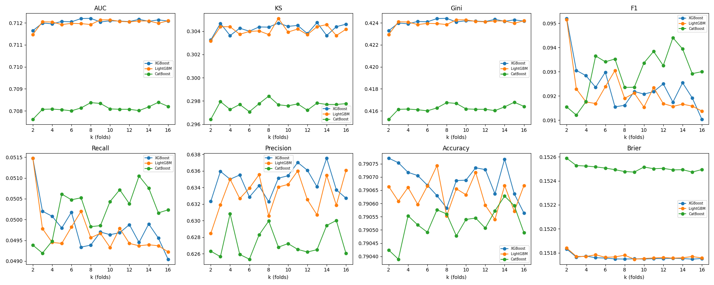
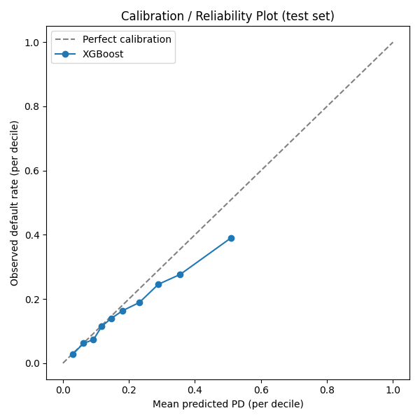
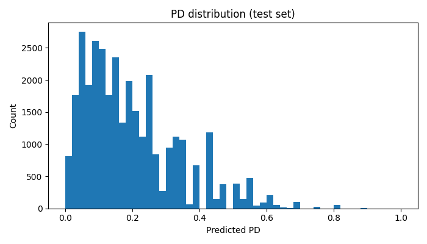
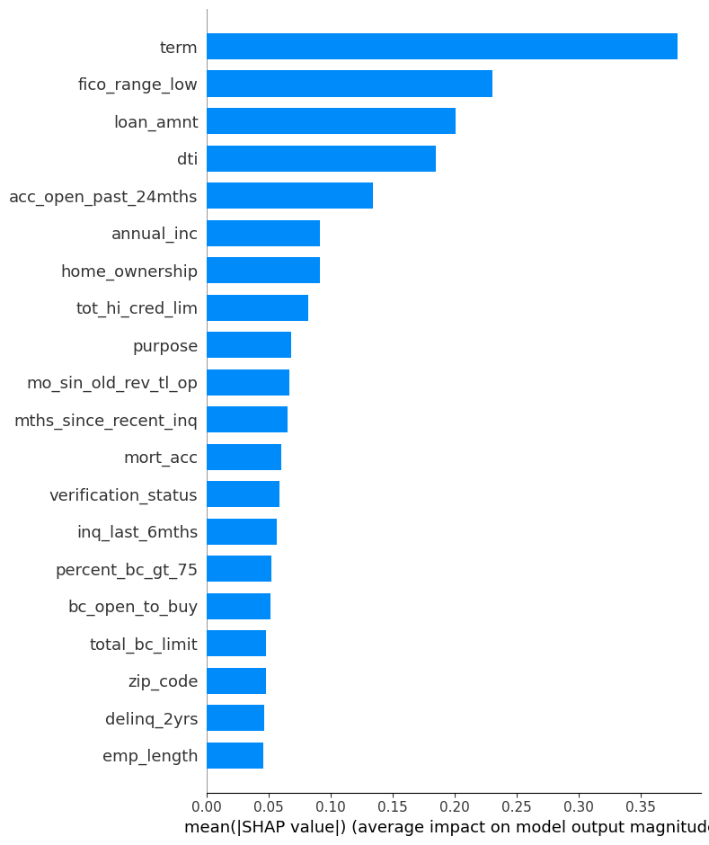

# Credit Risk — Probability of Default (PD) Model

## Contents
1. [What this project is](#1-what-this-project-is)
2. [Why this project](#2-why-this-project)
3. [Data](#3-data)
4. [Pipeline / repository structure](#4-pipeline--repository-structure)
5. [Architecture diagram](#5-architecture-diagram)
6. [How to run (quick start)](#6-how-to-run-quick-start)
7. [Modeling approach](#7-modeling-approach)
8. [Results](#8-results)
9. [Plots produced](#9-plots-produced)
10. [Why the rejected CSV was added after the core model](#10-why-the-rejected-csv-was-added-after-the-core-model-not-before)
11. [Key assumptions](#11-key-assumptions-made-throughout)
12. [Known limitations / next steps](#12-known-limitations--next-steps)
13. [Glossary](#13-glossary)


## 1. What this project is

A binary classification model that predicts **Probability of Default (PD)** for
consumer loans, using LendingClub-style accepted/rejected loan application data.
The end deliverable is a calibrated PD score per applicant, translated into risk
bands, with supporting explainability and a reject-inference extension to correct
for sample selection bias in the training data.

## 2. Why this project

Lenders need to price and approve/reject loans based on estimated default risk
*before* a loan is funded. A model trained naively on approved-loan outcomes
inherits two structural problems this project explicitly addresses:

- **Label leakage**: many raw fields in the source data (payment history,
  recoveries, hardship/settlement flags) only exist *after* a loan has already
  defaulted or been repaid — using them would let the model "cheat" by reading
  the outcome directly instead of predicting it.
- **Sample selection bias**: a model trained only on *accepted* loans has never
  seen outcomes for the population that was historically rejected, and that
  population is systematically different (riskier) by construction. This is
  addressed via reject inference in the later stage of the pipeline.

## 3. Data

| File | Rows (raw) | Columns | Contains outcome? | Role |
|---|---|---|---|---|
| Accepted loans CSV | 1,048,575 | 160 (raw) → 89 selected | Yes (`loan_status`) | Primary training/testing data |
| Rejected loans CSV | 1,048,575 | 9 (7 usable) | No — never funded, no repayment history exists | Used later for reject inference only |

**Why the column counts differ so much**: the accepted file has post-approval
loan servicing data (payment history, collections, hardship programs, etc.)
that simply doesn't exist for an application that was never funded. The
rejected file only ever captured what was known **at the moment of
application**: `Amount_Requested`, `Application_Date`, `Loan_Title`,
`Risk_Score`, `Debt-To-Income_Ratio`, `Zip_Code`, `State`,
`Employment_Length`, `Policy_Code`.

### Target definition (accepted data only)
Derived from `loan_status`:
- **1 (default)**: `Charged Off`, `Default`
- **0 (non-default)**: `Fully Paid`
- **Excluded**: `Current`, `Late (16-30 days)`, `Late (31-120 days)`,
  `In Grace Period`, and missing/NaN — these loans haven't reached a final
  outcome yet, so their eventual label is unknown.

Observed class balance after filtering: **611,803 resolved loans**,
**~21.1–21.4% default rate**.

## 4. Pipeline / repository structure

Scripts are numbered and meant to be run in order; each reads the outputs of
the previous one.

| Script | Purpose | Key outputs |
|---|---|---|
| `00_diagnose.py` | Diagnostic tool — checks raw file structure, header integrity, `loan_status` value counts. Run this first on any new raw file. | console output only |
| `preprocessing_pipeline.py` (01) | Load accepted data, drop leakage/redundant columns, derive target, engineer features, time-based train/test split | `train.csv`, `test.csv` |
| `02_eda.py` | Distributions, dtypes, missingness summary | `eda_summary.csv`, `eda_numeric_hists.png`, `eda_categorical_bars.png` |
| `03_missing_impute_encode.py` | Drop columns ≥35% missing, impute (mode/median/mean), label-encode categoricals | `train_imputed.csv`, `test_imputed.csv`, `label_encoders.pkl`, `dropped_cols.txt` |
| `04_kfold_train_eval.py` | Stratified k-fold CV (k = 2–16) across XGBoost / LightGBM / CatBoost | `kfold_results.csv`, `loss_curves.json` |
| `05_plot_results.py` | Plots of each metric vs. k per model, training loss curves | `metrics_vs_k.png`, `loss_curves.png` |
| `06_report_pd.py` | Final model (best CV performer), probability calibration, calibration plot, risk bands, SHAP explainability, held-out test metrics | `final_model.pkl`, `calibrator.pkl`, `pd_predictions_test.csv`, `risk_bands.csv`, `calibration_plot.png`, `pd_distribution.png`, `shap_summary.png`, `final_report_metrics.txt` |
| `07_reject_preprocessing.py` | Align rejected-file columns/formats to the accepted schema | `rejected_aligned.csv` |
| `08_reject_inference.py` | Reduced-feature baseline model, score rejects, fuzzy/parceling augmentation, retrain, compare | `rejected_scored.csv`, `reduced_model_baseline.pkl`, `reduced_model_augmented.pkl`, `reject_inference_comparison.txt` |

## 5. Architecture diagram



Two parallel tracks meet at script `08`: the accepted-data track (which alone
produces the validated PD model) and the rejected-data track (which only
ever contributes a bias-correction signal, never a directly trained outcome).


## 6. How to run (quick start)

**Trained model artifacts** (`final_model.pkl`, `calibrator.pkl`,
`reduced_model_baseline.pkl`, `reduced_model_augmented.pkl`,
`label_encoders.pkl`) aren't committed to this repo directly — download them
from the [Releases page](../../releases) instead, or regenerate them from
scratch by running the pipeline below. Place downloaded `.pkl` files in the
project root before running any script that loads them (e.g. `08` needs
`label_encoders.pkl`).

**Environment setup** (once):
```bash
pip install pandas numpy scikit-learn matplotlib xgboost lightgbm catboost shap --break-system-packages
```

**Run order** — each script reads files the previous one saved, so run them
in this sequence, from the same working directory:

```bash
python 00_diagnose.py                    # point PATH at your raw accepted CSV first
python preprocessing_pipeline.py         # update ACCEPTED_CSV_PATH at the top first
python 02_eda.py
python 03_missing_impute_encode.py
python 04_kfold_train_eval.py            # FAST_MODE=True first for a smoke test,
                                          # then False for the full run
python 05_plot_results.py
python 06_report_pd.py

python 07_reject_preprocessing.py        # update REJECTED_CSV_PATH at the top first
python 08_reject_inference.py
```

**Sanity checks along the way** (all are already built into the scripts as
assertions that fail loudly rather than silently propagating bad data):
row counts staying non-zero after loading and after target filtering, no
remaining NaNs after imputation, train/test column alignment after encoding,
AUC in a plausible range (not ~0.5 or suspiciously ~1.0), calibrated Brier
score improving on the raw Brier score.

## 7. Modeling approach

### Feature selection
Started from 160 raw columns → reduced to 89 on load → 62 final predictive
features after dropping:
- **Leakage columns** (post-origination payment/servicing/hardship/settlement fields)
- **Pricing/grading columns** (`grade`, `sub_grade`, `int_rate`, `installment`) —
  excluded because they're LendingClub's own risk-based output, not raw
  applicant signal; including them would mean reverse-engineering an existing
  score rather than building an independent one
- **Unusable free text / zero-variance** (`emp_title`, `title`, `policy_code`)
- **High-missingness joint/co-applicant fields** (kept only `annual_inc_joint`,
  `dti_joint`, `verification_status_joint`, `revol_bal_joint`,
  `sec_app_fico_range_low/high`; dropped 10 other `sec_app_*` fields — joint
  applications are only ~5.6% of the data, too sparse for the rest to be
  learnable)

### Models
Three gradient-boosted tree models trained and compared: **XGBoost, LightGBM,
CatBoost**. Tree-based models were chosen over logistic regression for this
build because:
- Native handling of missing values (no forced imputation strategy needed
  during CV, though imputation was still applied for consistency/portability)
- No manual interaction/nonlinearity engineering required
- Strong baseline performance on tabular credit data

*(Logistic regression + WOE/IV binning remains the standard alternative if
regulatory interpretability requirements make it necessary — not used here.)*

### Validation
- **Time-based (out-of-time) train/test split** on `issue_d` (not random) —
  because credit data drifts over time, and a random split would overstate
  real-world accuracy.
- **Stratified k-fold CV, k = 2 to 16**, across all three models, to assess
  stability of model ranking before committing to a final model choice.


*AUC, KS, Gini, and other metrics stayed roughly flat across k for all three
models — meaning the model ranking wasn't sensitive to the fold count
chosen, a useful stability check before picking a final model.*

- **Winning model selected by mean CV AUC**: **XGBoost**, in this run.

### Metrics
- **AUC-ROC, KS statistic, Gini coefficient** — the standard credit-risk
  trio; used over plain accuracy because the target is imbalanced (~21%
  positive rate).
- **F1, Recall, Precision, Accuracy** — supplementary classification metrics.
- **Brier score** used in place of R²/RMSE/MAE, which requested but aren't
  meaningful for a probabilistic binary classifier — Brier score is the
  calibration-focused analog (mean squared error between predicted
  probability and actual 0/1 outcome).

### Calibration
Raw tree-model outputs rank-order well but aren't reliable probabilities.
**Isotonic regression** was fit on a held-out 20% slice of the training data
(never touched by model fitting or final testing) to convert raw scores into
calibrated PD values. A built-in check confirms calibrated Brier score
doesn't exceed the raw score's Brier score (i.e., calibration actually
helped) before proceeding.

### Explainability
**SHAP (TreeExplainer)** computed on the final raw model (calibration is
monotonic, so it doesn't change feature importance ranking — SHAP on the raw
model is standard practice). Produces both global feature importance
(`shap_summary.png`) and the underlying values for per-applicant explanation.

## 8. Results (actual, from the completed run)

**Held-out test set performance (full 62-feature model, XGBoost):**

| Metric | Value |
|---|---|
| AUC-ROC | **0.7144** |
| Gini | **0.4288** |
| KS statistic | **0.3068** |
| Brier score (raw) | 0.1281 |
| Brier score (calibrated) | 0.1285 |

AUC of 0.71 / KS of 0.31 is a reasonable, unremarkable result for a
credit-risk PD model built on raw, non-price-based applicant features (recall
`grade`/`sub_grade`/`int_rate` were deliberately excluded — see Section 11).

**⚠ Calibration note**: the calibrated Brier score (0.1285) is very slightly
*worse* than the raw model's Brier score (0.1281). Isotonic calibration
didn't meaningfully help here — it passed the build-in check only because
that check allows up to a 5% degradation, not because calibration
demonstrably improved anything. The risk-band table below shows why: the
model is **overconfident at the high-risk end**.

**Follow-up investigation — isotonic vs. sigmoid (Platt) calibration**: to
rule out "wrong calibration method" as the cause, sigmoid calibration was
tried as an alternative and directly compared in the top-20%-risk tail
(roughly grades I/J):

| Method | Overall Brier | Tail gap (top 20% risk) |
|---|---|---|
| Isotonic | 0.12850 | **0.0938** |
| Sigmoid | 0.12951 | 0.1052 |

Isotonic actually performs *better* in the tail than sigmoid on both
metrics — ruling out a simple method swap as the fix. **This points to a
data sparsity problem, not a methodology problem**: the calibration split
(20% of train) has relatively few high-risk examples for the calibrator to
fit against in that sparse region, so its tail estimate is less reliable
regardless of which calibration technique is used. This is a genuine,
documented limitation rather than a resolved issue — see Section 12 for
next steps if closing this gap becomes a priority (larger calib split,
bucket-specific recalibration).

**Risk bands (deciles), held-out test set:**

| Grade | Predicted PD range | N | Mean predicted PD | Observed default rate | Gap |
|---|---|---|---|---|---|
| A | 0.000–0.048 | 3,870 | 3.08% | 2.89% | +0.19 |
| B | 0.048–0.071 | 3,395 | 6.25% | 6.19% | +0.06 |
| C | 0.071–0.096 | 2,610 | 9.25% | 7.32% | +1.93 |
| D | 0.096–0.130 | 3,592 | 11.79% | 11.53% | +0.26 |
| E | 0.130–0.158 | 3,011 | 14.76% | 14.02% | +0.74 |
| F | 0.158–0.197 | 3,243 | 18.14% | 16.37% | +1.77 |
| G | 0.197–0.250 | 4,471 | 23.17% | 18.90% | +4.27 |
| H | 0.250–0.308 | 2,389 | 28.92% | 24.57% | +4.35 |
| I | 0.308–0.426 | 3,074 | 35.54% | 27.65% | **+7.89** |
| J | 0.426–1.000 | 3,184 | 50.95% | 39.04% | **+11.91** |

**Reading this table**: grades A–F track observed default rate closely
(gap under ~2 points) — the model is well-calibrated for low-to-mid risk
applicants. Grades G–J diverge substantially, and the divergence grows with
risk: by grade J, the model predicts a 51% default rate but only 39% of
those loans actually defaulted. **The model systematically overstates risk
for the riskiest applicants.** This matters directly for any use of this
model to set approval thresholds or price loans at the high-risk end — using
the raw predicted PD as-is would over-reject or over-price that segment.

**Likely causes worth investigating before production use**: fewer
high-risk training examples for the calibrator to learn from (isotonic
regression is data-hungry in sparse regions), or genuine model overconfidence
in the raw XGBoost scores at the tails. Worth trying `method="sigmoid"`
(Platt scaling) instead of isotonic in `06_report_pd.py`, or binning grades
G–J more finely to see where exactly the divergence starts.

**Pipeline-stage numbers** (for reference):
- Raw accepted data loaded: 1,048,575 rows × 89 columns
- After filtering to resolved loans: 611,803 rows, target positive rate ~21.2%
- After imputation/encoding: 578,964 rows × 62 features, positive rate 21.384%
- Best model by mean CV AUC (k=2–16): XGBoost
- Reduced 6-feature model (accepted-only, used only for reject scoring):
  test AUC 0.6435, KS 0.2056 — weaker than the full model as expected, since
  it only has 6 of the 62 features available
- See `reject_inference_comparison.txt` for baseline-vs-augmented performance
  after incorporating reject inference

### Supporting visuals


*Reliability diagram for the held-out test set. Grades A–F sit close to the
diagonal (well-calibrated); grades G–J drift below it — the model
overstates default risk for the highest-risk applicants, as detailed above.*


*Distribution of predicted PD across the test set — most applicants cluster
at low-to-moderate risk, consistent with the ~21% overall default rate.*


*Top drivers of the model's predictions, by mean absolute SHAP value —
useful both for sanity-checking that the model leans on plausible
credit-risk signals, and as a starting point for per-applicant explanations.*

*(`eda_numeric_hists.png`, `eda_categorical_bars.png`, and `loss_curves.png`
are also in the repo but not embedded here — they're exploratory/diagnostic
rather than results, open them directly if useful.)*

## 9. Plots produced

| File | Shows |
|---|---|
| `eda_numeric_hists.png` / `eda_categorical_bars.png` | Raw feature distributions |
| `metrics_vs_k.png` | AUC/KS/Gini/F1/Recall/Precision/Accuracy/Brier vs. number of CV folds, per model |
| `loss_curves.png` | Validation AUC per boosting round, smallest and largest k tested |
| `calibration_plot.png` | Reliability diagram — predicted PD vs. actual observed default rate by decile (closer to the diagonal = better calibrated) |
| `pd_distribution.png` | Histogram of predicted PD across the test set |
| `shap_summary.png` | Global feature importance (mean absolute SHAP value), top 20 features |

## 10. Why the rejected CSV was added *after* the core model, not before

The rejected file has **no outcome label** — these applicants were never
funded, so there's no repayment behavior to observe. It therefore cannot be
used to train or validate a PD model directly, and was deliberately excluded
from the model-building phase (scripts 01–06). It becomes relevant only for
**reject inference** (script 08): correcting for the fact that a model
trained solely on accepted applicants has never seen outcomes for the
(systematically riskier) rejected population, and may be miscalibrated or
overconfident when scoring new applicants who resemble historical rejects.

Reject inference proceeds in this order specifically because it's an
*enhancement layer* on a working model, not a prerequisite — building it
first, before a validated baseline existed, would have made it impossible to
tell whether any resulting change in performance came from the augmentation
itself or from an unvalidated base model.

## 11. Key assumptions made throughout

- **Date formats**: LendingClub dates use 2-digit years (`"Dec-15"`,
  `"Aug-03"`) — parsed with `%b-%y`, not `%b-%Y`. A 4-digit-year assumption
  silently produced an all-`NaT` column and a 0/0 train-test split earlier in
  development; guard-rail assertions were added afterward to catch this class
  of failure loudly instead of silently.
- **`grade`/`sub_grade`/`int_rate`/`installment` excluded** on the judgment
  that an independent PD model shouldn't be trained to reproduce another
  scoring system's output; these can be added back later purely to
  *benchmark* against LendingClub's own grading, not as model features.
- **Joint/co-applicant fields**: kept only where non-missing rate was high
  enough to be learnable (~5.6% of applications are joint); the other
  `sec_app_*` tradeline fields were dropped as too sparse to add signal over
  noise.
- **`risk_score` (rejected file) ≈ `(fico_range_low + fico_range_high) / 2`
  (accepted file)** — a modeling approximation, not an exact equivalence,
  used to make the two files comparable for reject inference.
- **`Application_Date` (rejected) ≠ `issue_d` (accepted)** — application
  timing vs. funding/origination timing are conceptually different, and the
  public accepted dataset doesn't expose true application date. Used only for
  the rejected file's own housekeeping, never merged into `issue_d`.
- **`zip_code`/`emp_length` are plain numeric, not categorical, in the final
  model matrices** — an artifact of how pandas re-infers dtypes across CSV
  round-trips (all-digit strings get auto-cast to int64 on reload). This was
  discovered via a `KeyError` during reject-file encoding and is now handled
  correctly, but is worth knowing if extending the pipeline further: these
  two fields are NOT going through `label_encoders.pkl` the way other
  categoricals are.
- **Reject inference does not produce ground truth.** Nobody will ever know
  whether a specific rejected applicant would have defaulted. Fuzzy/parceling
  augmentation is a documented bias-correction heuristic from the
  credit-risk literature, not a way to manufacture real labels — treat any
  resulting model as something to monitor in production, not something
  "validated" by this process.

## 12. Known limitations / natural next steps

- **Tail calibration gap in grades I/J remains unresolved** (isotonic tail
  gap 0.094, confirmed not fixable by switching to sigmoid calibration —
  see Section 8). Most likely cause: sparse high-risk examples in the 20%
  calibration split. Two concrete next steps if this needs closing: (a)
  increase the calibration split size (currently 20% of train), trading off
  against less data for the base model fit, or (b) bucket-specific
  recalibration — fit a separate, simpler adjustment just for the top
  deciles instead of one isotonic curve across the full range.
- **Reduced-feature (6-column) model, used for scoring rejects, is now
  calibrated** (isotonic, fit on the held-out accepted test set — see
  `reduced_model_calibrator.pkl`) before being used for fuzzy/parceling
  augmentation weights. Still meaningfully weaker than the full model
  (AUC 0.6435 vs. 0.7144) — reject inference conclusions are only as good
  as this reduced model's ability to rank-order risk on 6 features.
- **Reject inference stability confirmed, not "validated."** Comparing
  baseline vs. augmented model on accepted test data showed a small,
  stable shift (ΔAUC −0.0046, ΔKS −0.0090 — well within the 0.02/0.03
  flag thresholds built into the script). This confirms augmentation
  didn't destabilize known-label performance, but — as always with reject
  inference — it cannot confirm the augmented model is actually better at
  scoring real rejected applicants, since no ground truth exists for them.
- No regulatory/adverse-action-notice tooling built yet (would layer on top
  of the existing SHAP explainability).
- The full 62-feature model does not yet incorporate reject inference
  directly — only the 6-feature reduced model does. Folding reject-inference
  insight back into the full model requires deciding how to handle the ~56
  features that simply don't exist for rejected applicants (a design
  decision, not yet made).
- Model currently retrained from a single time-based split; a rolling/
  multiple-vintage backtest would give a more robust view of stability over
  time before production use.

## 13. Glossary

| Term | Meaning |
|---|---|
| **PD** | Probability of Default — the model's core output; likelihood a loan ends in charge-off/default rather than being fully repaid |
| **AUC-ROC** | Area under the ROC curve; how well the model rank-orders risky vs. safe applicants (0.5 = random, 1.0 = perfect) |
| **KS statistic** | Kolmogorov-Smirnov; the maximum separation between the model's true-positive and false-positive rates — a standard credit-risk discrimination metric alongside AUC |
| **Gini coefficient** | `2 x AUC - 1`; another standard discrimination metric, common in credit scoring literature |
| **Brier score** | Mean squared error between predicted probability and actual 0/1 outcome; measures calibration quality, not just rank-ordering |
| **Calibration** | Whether a predicted probability (e.g. 20%) matches the actual observed rate (e.g. does this bucket really default ~20% of the time) |
| **WOE / IV** | Weight of Evidence / Information Value — standard binning technique for logistic-regression credit scorecards (not used in this build, which is tree-based) |
| **SHAP** | SHapley Additive exPlanations; attributes a model's prediction to individual input features, both globally and per-applicant |
| **Reject inference** | Techniques (e.g. fuzzy/parceling augmentation) that attempt to correct for the fact that a model trained only on accepted applicants never observed outcomes for the rejected population |
| **Out-of-time split** | Train/test split based on time (e.g. loan issue date) rather than random shuffling, to better reflect real-world deployment where the model sees only future applicants |
| **Leakage** | A feature that indirectly reveals the target because it was only recorded after the outcome was already known (e.g. payment history for a loan that already defaulted) |
